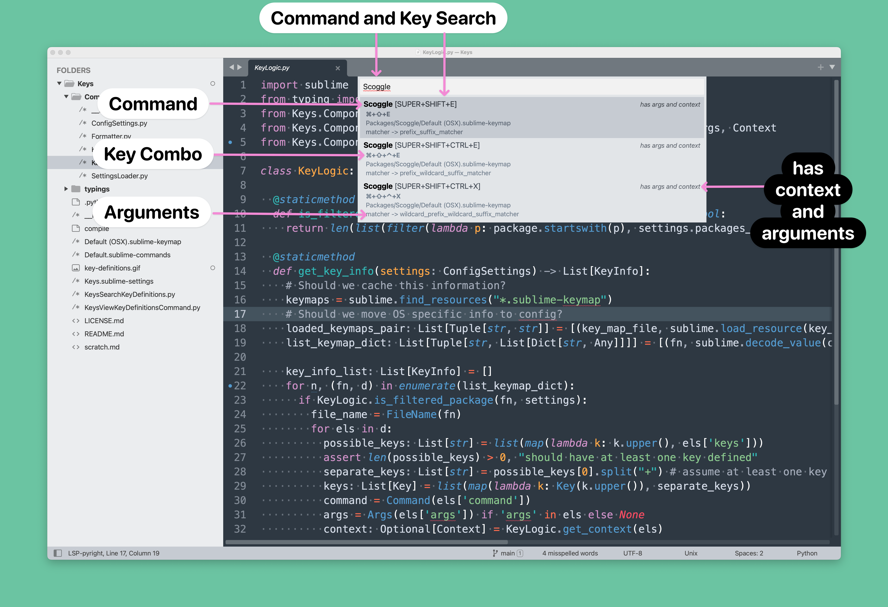

# Keys

[Sublime Text](https://www.sublimetext.com/) plugin to display mapped keys.



## Installation

- Open the command palette with `CMD + SHIT + P`
- Select `Package Control: Add Repository`
- Enter https://github.com/ssanj/OpenTabs for the repository
- Select `Package Control: Install Package`
- Choose Keys


## Functionality

### Search by command or key

To search by command name or key(s) use `F1`


### List all keys

To list all keys press `SHIFT` + `F1`.


#### Searching by Command


#### Searching by Key


## Settings

Default *Keys.sublime-settings* file:

```
{

  // Controls which packages' keys to display when searching
  // These names are used as paths so the trailing '/' is required
  "packages_to_filter_in": [
    "Packages/"
  ],

  // Maps keys to symbols or alternate text.
  "symbol_map": {},

  // Maps command + args combo to more friendly label used when searching for keys
  "label_map_list": [],

  // When debug is true, the settings loaded are written to the logs
  // Also if this setting can't be read (because of some issue with the config)
  // debug is on by default and will write out some useful information.
  "debug": false
}
```

A more fleshed out *Keys.sublime-settings* file:

```
{

  // Only shows these packages in when searching for keys
  "packages_to_filter_in": [
    "Packages/User/",
    "Packages/SymbolView/",
    "Packages/RecentFolders/",
    "Packages/QuickView/",
    "Packages/QuickView/",
    "Packages/OpenWindows/",
    "Packages/OpenTabs/",
    "Packages/OpenSplit/",
    "Packages/Keys/",
    "Packages/Ghomments/",
    "Packages/BlogTools/",
    "Packages/Scoggle/",
    "Packages/Quick File Creator/",
    "Packages/LSP/",
    "Packages/Default/",
  ],

  // Remap these keys to symbols
  "symbol_map": {
    "COMMAND": "⌘",
    "SUPER": "⌘",
    "PRIMARY": "⌘",
    "CTRL": "⌃",
    "OPTION": "⌥",
    "ALT": "⌥",
    "SHIFT": "⇧",
    "UP": "↑",
    "DOWN": "↓",
    "TAB": "⇥",
    "LEFT": "←",
    "RIGHT": "→",
  },

  // Maps command + args combo to more friendly labels used when searching for keys
  "label_map_list": [
    {
      "command": "scoggle",
      "args": {"matcher": "prefix_suffix_matcher"},
      "label": "Scoggle: Prefix Suffix Matcher"
    },
    {
      "command": "scoggle",
      "args": {"matcher": "prefix_wildcard_suffix_matcher"},
      "label": "Scoggle: Prefix Wildcard Suffix Matcher"
    },
    {
      "command": "scoggle",
      "args": {"matcher": "wildcard_prefix_wildcard_suffix_matcher"},
      "label": "Scoggle: Prefix Wildcard Suffix Wildcard Matcher"
    },
    {
      "command": "package",
      "args": {"style": "full"},
      "label": "Scoggle: Insert Full package"
    },
    {
      "command": "package",
      "args": {"style": "step"},
      "label": "Scoggle: Insert Stepped package"
    },
  ],

  "debug": false
}
```

**packages_to_filter_in** - defines the packages to include when doing a search or displaying key definitions. If you want all the packages use a value of `["Packages/"]`. These values are are used as paths so the trailing '/' is required.

**symbol_map** - Mapping between the text in the keymap file and the symbol or alternate text you wish to see. If you don't want any mapping use an empty object here: `{}`

**label_map_list** - Mapping between a command name and its arguments to a more user friendly label. Why? Command names are not very nice to look at. Let's use something more descriptive.

In the example below, the command `scoggle` with arguments of `{"matcher": "prefix_suffix_matcher"}` will be matched to the label `Scoggle: Prefix Suffix Matcher` when searching for keys. If this mapping was not defined, the search quick view would display `Scoggle` as the name of the command.

```
"label_map_list": [
    {
      "command": "scoggle", // with this command name
      "args": {"matcher": "prefix_suffix_matcher"}, // and this argument set
      "label": "Scoggle: Prefix Suffix Matcher" // display this name in the search quick view
    }
]
```

**debug** - Set to `true` if you want to see the settings loaded by Keys. If the settings can't be loaded correctly, this will automatically toggle to true and write out any settings being used as defaults
